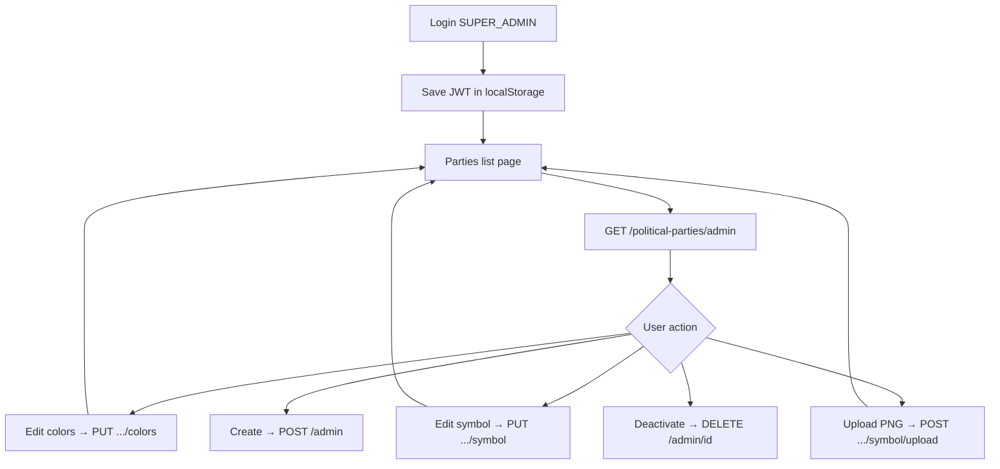

# India Political Parties — React (Super Admin) Integration Guide

Complete step-by-step guide for your **React / React Admin** panel. All examples use **fetch** (no extra library required). You can copy-paste into Axios if you prefer.

---

## 1. Base setup

| Item | Value |
|------|--------|
| **Production API** | `https://api.kaburlumedia.com/api/v1` |
| **Swagger UI** | [https://api.kaburlumedia.com/api/v1/docs](https://api.kaburlumedia.com/api/v1/docs) → tag **India Political Parties** |
| **Auth** | JWT from `POST /auth/login` (user must be **SUPER_ADMIN**) |
| **Header** | `Authorization: Bearer <jwt>` on every admin call |

### Environment (`.env` in React app)

```env
VITE_API_BASE_URL=https://api.kaburlumedia.com/api/v1
```

---

## 2. Step 1 — Login (Super Admin)

```http
POST /api/v1/auth/login
Content-Type: application/json

{
  "mobileNumber": "9392010248",
  "mpin": "1234"
}
```

**Success response (shape):**

```json
{
  "success": true,
  "data": {
    "jwt": "eyJhbGciOiJIUzI1NiIs...",
    "refreshToken": "...",
    "expiresIn": 86400,
    "user": {
      "userId": "clx...",
      "role": "SUPER_ADMIN"
    }
  }
}
```

**React — save token after login:**

```jsx
// src/auth/loginSuperAdmin.js
const API = import.meta.env.VITE_API_BASE_URL;

export async function loginSuperAdmin(mobileNumber, mpin) {
  const res = await fetch(`${API}/auth/login`, {
    method: 'POST',
    headers: { 'Content-Type': 'application/json' },
    body: JSON.stringify({ mobileNumber, mpin }),
  });
  const json = await res.json();
  if (!res.ok || !json.success) {
    throw new Error(json.error || json.message || 'Login failed');
  }
  if (json.data?.user?.role !== 'SUPER_ADMIN') {
    throw new Error('Only SUPER_ADMIN can manage political parties');
  }
  localStorage.setItem('kaburlu_jwt', json.data.jwt);
  return json.data;
}
```

---

## 3. Step 2 — Shared API helper

```js
// src/api/client.js
const API = import.meta.env.VITE_API_BASE_URL;

function getToken() {
  return localStorage.getItem('kaburlu_jwt');
}

export async function apiRequest(path, options = {}) {
  const headers = {
    ...(options.body instanceof FormData ? {} : { 'Content-Type': 'application/json' }),
    ...options.headers,
  };
  const token = getToken();
  if (token) headers.Authorization = `Bearer ${token}`;

  const res = await fetch(`${API}${path}`, { ...options, headers });
  const json = await res.json().catch(() => ({}));

  if (!res.ok) {
    throw new Error(json.error || json.message || `HTTP ${res.status}`);
  }
  return json;
}
```

---

## 4. Party object (TypeScript types)

```ts
// src/types/politicalParty.ts
export type PoliticalPartyRecognition =
  | 'NATIONAL'
  | 'STATE'
  | 'REGISTERED_UNRECOGNIZED';

export type PoliticalPartyColorSource = 'ECI' | 'MANUAL' | 'AI_CURATED';

export interface IndianPoliticalParty {
  id: string;
  shortCode: string;           // e.g. "BJP", "BRS"
  name: string;
  abbreviation: string | null;
  recognition: PoliticalPartyRecognition;
  symbolName: string | null;   // ECI text e.g. "Lotus"
  symbolImageUrl: string | null;
  primaryColor: string;        // "#FF9933"
  secondaryColor: string;
  states: string[];
  headquartersAddress: string | null;
  eciSerialNumber: number | null;
  eciNotificationRef: string | null;
  eciSourceUrl: string | null;
  colorSource: PoliticalPartyColorSource;
  isActive: boolean;
}

export interface PartyListResponse {
  success: true;
  total: number;
  page: number;
  limit: number;
  totalPages: number;
  items: IndianPoliticalParty[];
}
```

---

## 5. API reference (all endpoints)

### Legend

| Icon | Meaning |
|------|---------|
| 🌐 | Public — no JWT |
| 🔒 | Super Admin — JWT required |

---

### 5.1 🌐 Search parties (public)

Use in **mobile app / website** dropdowns. Only **active** parties.

```http
GET /political-parties?q=bharat&recognition=NATIONAL&state=Telangana&page=1&limit=20
```

**Sample response:**

```json
{
  "success": true,
  "total": 2850,
  "page": 1,
  "limit": 20,
  "totalPages": 143,
  "items": [
    {
      "id": "clxyz...",
      "shortCode": "BJP",
      "name": "Bharatiya Janata Party",
      "abbreviation": "BJP",
      "recognition": "NATIONAL",
      "symbolName": "Lotus",
      "symbolImageUrl": "https://kaburlu-news.b-cdn.net/political-parties/symbols/bjp.png",
      "primaryColor": "#FF9933",
      "secondaryColor": "#FFFFFF",
      "states": [],
      "isActive": true,
      "colorSource": "MANUAL"
    }
  ]
}
```

```js
// src/api/politicalParties.js
export function searchPartiesPublic({ q, state, recognition, page = 1, limit = 20 }) {
  const params = new URLSearchParams({ page: String(page), limit: String(limit) });
  if (q) params.set('q', q);
  if (state) params.set('state', state);
  if (recognition) params.set('recognition', recognition);
  return apiRequest(`/political-parties?${params}`, { method: 'GET' });
}
```

---

### 5.2 🌐 Get one party by id or shortCode

```http
GET /political-parties/BJP
GET /political-parties/clxyz...
```

```json
{
  "success": true,
  "data": {
    "id": "clxyz...",
    "shortCode": "BJP",
    "name": "Bharatiya Janata Party",
    "primaryColor": "#FF9933",
    "secondaryColor": "#FFFFFF",
    "symbolName": "Lotus",
    "symbolImageUrl": "https://kaburlu-news.b-cdn.net/political-parties/symbols/bjp.png"
  }
}
```

```js
export function getPartyPublic(idOrCode) {
  return apiRequest(`/political-parties/${encodeURIComponent(idOrCode)}`, { method: 'GET' });
}
```

---

### 5.3 🔒 Admin list (includes inactive)

```http
GET /political-parties/admin?q=brs&isActive=true&recognition=STATE&page=1&limit=50
Authorization: Bearer <jwt>
```

Query params:

| Param | Example | Notes |
|-------|---------|--------|
| `q` | `telangana` | Search name, code, symbol |
| `state` | `Telangana` | State filter |
| `recognition` | `STATE` | `NATIONAL` \| `STATE` \| `REGISTERED_UNRECOGNIZED` |
| `isActive` | `true` / `false` | Omit for all |
| `page`, `limit` | `1`, `50` | Max limit **200** |

```js
export function adminListParties(filters = {}) {
  const params = new URLSearchParams();
  Object.entries(filters).forEach(([k, v]) => {
    if (v !== undefined && v !== '') params.set(k, String(v));
  });
  return apiRequest(`/political-parties/admin?${params}`, { method: 'GET' });
}
```

---

### 5.4 🔒 Create party

```http
POST /political-parties/admin
Authorization: Bearer <jwt>
Content-Type: application/json

{
  "shortCode": "BRS",
  "name": "Bharat Rashtra Samithi",
  "abbreviation": "BRS",
  "recognition": "STATE",
  "symbolName": "Car",
  "primaryColor": "#E91E63",
  "secondaryColor": "#FFFFFF",
  "states": ["Telangana"],
  "colorSource": "MANUAL"
}
```

**201 response:**

```json
{
  "success": true,
  "data": { "id": "clnew...", "shortCode": "BRS", "...": "..." }
}
```

**409** if `shortCode` already exists.

```js
export function adminCreateParty(body) {
  return apiRequest('/political-parties/admin', {
    method: 'POST',
    body: JSON.stringify(body),
  });
}
```

---

### 5.5 🔒 Get party by id (admin)

```http
GET /political-parties/admin/{id}
```

Works even if `isActive: false`.

```js
export function adminGetParty(id) {
  return apiRequest(`/political-parties/admin/${id}`, { method: 'GET' });
}
```

---

### 5.6 🔒 Full update

```http
PUT /political-parties/admin/{id}
Content-Type: application/json

{
  "name": "Bharat Rashtra Samithi",
  "abbreviation": "BRS",
  "recognition": "STATE",
  "states": ["Telangana"],
  "isActive": true
}
```

Send only fields you want to change (partial update supported).

```js
export function adminUpdateParty(id, body) {
  return apiRequest(`/political-parties/admin/${id}`, {
    method: 'PUT',
    body: JSON.stringify(body),
  });
}
```

---

### 5.7 🔒 Update colors only

Best for a **color picker** screen.

```http
PUT /political-parties/admin/{id}/colors
Content-Type: application/json

{
  "primaryColor": "#FF9933",
  "secondaryColor": "#138808",
  "colorSource": "MANUAL"
}
```

Rules:
- Colors must be `#RRGGBB` (6 hex digits).
- `colorSource` optional; defaults to `MANUAL` when colors change.

```js
export function adminUpdatePartyColors(id, { primaryColor, secondaryColor, colorSource }) {
  return apiRequest(`/political-parties/admin/${id}/colors`, {
    method: 'PUT',
    body: JSON.stringify({ primaryColor, secondaryColor, colorSource }),
  });
}
```

**React color form example:**

```jsx
function PartyColorForm({ partyId, initialPrimary, initialSecondary, onSaved }) {
  const [primaryColor, setPrimary] = useState(initialPrimary || '#1A237E');
  const [secondaryColor, setSecondary] = useState(initialSecondary || '#FFFFFF');
  const [loading, setLoading] = useState(false);
  const [error, setError] = useState('');

  async function handleSubmit(e) {
    e.preventDefault();
    setLoading(true);
    setError('');
    try {
      const res = await adminUpdatePartyColors(partyId, {
        primaryColor,
        secondaryColor,
        colorSource: 'MANUAL',
      });
      onSaved?.(res.data);
    } catch (err) {
      setError(err.message);
    } finally {
      setLoading(false);
    }
  }

  return (
    <form onSubmit={handleSubmit}>
      <label>
        Primary
        <input type="color" value={primaryColor} onChange={(e) => setPrimary(e.target.value)} />
        <input value={primaryColor} onChange={(e) => setPrimary(e.target.value)} />
      </label>
      <label>
        Secondary
        <input type="color" value={secondaryColor} onChange={(e) => setSecondary(e.target.value)} />
      </label>
      {error && <p style={{ color: 'red' }}>{error}</p>}
      <button type="submit" disabled={loading}>{loading ? 'Saving…' : 'Save colors'}</button>
    </form>
  );
}
```

---

### 5.8 🔒 Update symbol name / image URL

```http
PUT /political-parties/admin/{id}/symbol
Content-Type: application/json

{
  "symbolName": "Lotus",
  "symbolImageUrl": "https://kaburlu-news.b-cdn.net/political-parties/symbols/bjp.png"
}
```

```js
export function adminUpdatePartySymbol(id, { symbolName, symbolImageUrl }) {
  return apiRequest(`/political-parties/admin/${id}/symbol`, {
    method: 'PUT',
    body: JSON.stringify({ symbolName, symbolImageUrl }),
  });
}
```

---

### 5.9 🔒 Upload symbol PNG (multipart)

Upload converts image to PNG and stores on **Bunny CDN**.

```http
POST /political-parties/admin/{id}/symbol/upload
Authorization: Bearer <jwt>
Content-Type: multipart/form-data

file: <binary PNG/JPG, max 2MB>
```

**Field name must be `file`.**

```js
export async function adminUploadPartySymbol(id, file) {
  const form = new FormData();
  form.append('file', file);
  return apiRequest(`/political-parties/admin/${id}/symbol/upload`, {
    method: 'POST',
    body: form,
  });
}
```

**React file input:**

```jsx
function SymbolUpload({ partyId, onUploaded }) {
  async function onChange(e) {
    const file = e.target.files?.[0];
    if (!file) return;
    if (file.size > 2 * 1024 * 1024) {
      alert('Max file size 2MB');
      return;
    }
    try {
      const res = await adminUploadPartySymbol(partyId, file);
      onUploaded(res.data); // data.symbolImageUrl has CDN URL
    } catch (err) {
      alert(err.message);
    }
  }
  return <input type="file" accept="image/png,image/jpeg,image/webp" onChange={onChange} />;
}
```

---

### 5.10 🔒 Soft delete (deactivate)

```http
DELETE /political-parties/admin/{id}
```

Sets `isActive: false`. Public APIs will not return this party.

```js
export function adminDeactivateParty(id) {
  return apiRequest(`/political-parties/admin/${id}`, { method: 'DELETE' });
}
```

---

### 5.11 🔒 Import ECI seed (one-time / refresh)

```http
POST /political-parties/admin/import-seed
```

Imports bundled national + state parties from server JSON. Safe to run multiple times (upsert).

```json
{
  "success": true,
  "imported": 25,
  "total": 2850,
  "source": "eci-national-state-seed.json"
}
```

---

### 5.12 🔒 AI color enrichment (batch)

```http
POST /political-parties/admin/enrich-colors
Content-Type: application/json

{
  "limit": 30,
  "force": false
}
```

- `limit`: max **100** parties per call.
- `force`: `true` = overwrite existing colors.

```js
export function adminEnrichColors(limit = 30, force = false) {
  return apiRequest('/political-parties/admin/enrich-colors', {
    method: 'POST',
    body: JSON.stringify({ limit, force }),
  });
}
```

---

## 6. Super Admin screen flow (recommended)



### Suggested React routes

| Route | Screen |
|-------|--------|
| `/login` | Mobile + MPIN |
| `/admin/parties` | Table + search + filters |
| `/admin/parties/new` | Create form |
| `/admin/parties/:id` | Detail + tabs: Info, Colors, Symbol |

---

## 7. Full service module (copy-paste)

```js
// src/api/politicalPartiesService.js
import { apiRequest } from './client';

const base = '/political-parties';

export const politicalPartiesApi = {
  // Public
  searchPublic: (filters) => {
    const p = new URLSearchParams(filters);
    return apiRequest(`${base}?${p}`);
  },
  getPublic: (idOrCode) => apiRequest(`${base}/${encodeURIComponent(idOrCode)}`),

  // Admin
  list: (filters) => {
    const p = new URLSearchParams(filters);
    return apiRequest(`${base}/admin?${p}`);
  },
  get: (id) => apiRequest(`${base}/admin/${id}`),
  create: (body) => apiRequest(`${base}/admin`, { method: 'POST', body: JSON.stringify(body) }),
  update: (id, body) =>
    apiRequest(`${base}/admin/${id}`, { method: 'PUT', body: JSON.stringify(body) }),
  updateColors: (id, body) =>
    apiRequest(`${base}/admin/${id}/colors`, { method: 'PUT', body: JSON.stringify(body) }),
  updateSymbol: (id, body) =>
    apiRequest(`${base}/admin/${id}/symbol`, { method: 'PUT', body: JSON.stringify(body) }),
  uploadSymbol: (id, file) => {
    const form = new FormData();
    form.append('file', file);
    return apiRequest(`${base}/admin/${id}/symbol/upload`, { method: 'POST', body: form });
  },
  deactivate: (id) => apiRequest(`${base}/admin/${id}`, { method: 'DELETE' }),
  importSeed: () => apiRequest(`${base}/admin/import-seed`, { method: 'POST', body: '{}' }),
  enrichColors: (limit, force) =>
    apiRequest(`${base}/admin/enrich-colors`, {
      method: 'POST',
      body: JSON.stringify({ limit, force }),
    }),
};
```

---

## 8. Example: Parties table page

```jsx
// src/pages/AdminPartiesPage.jsx
import { useEffect, useState } from 'react';
import { politicalPartiesApi } from '../api/politicalPartiesService';

export default function AdminPartiesPage() {
  const [items, setItems] = useState([]);
  const [q, setQ] = useState('');
  const [page, setPage] = useState(1);
  const [totalPages, setTotalPages] = useState(1);
  const [loading, setLoading] = useState(false);
  const [error, setError] = useState('');

  async function load() {
    setLoading(true);
    setError('');
    try {
      const res = await politicalPartiesApi.list({
        q,
        page,
        limit: 25,
        isActive: 'true',
        recognition: 'NATIONAL', // optional filter
      });
      setItems(res.items);
      setTotalPages(res.totalPages);
    } catch (e) {
      setError(e.message);
      if (e.message.includes('401')) {
        window.location.href = '/login';
      }
    } finally {
      setLoading(false);
    }
  }

  useEffect(() => {
    load();
  }, [q, page]);

  return (
    <div>
      <h1>India Political Parties</h1>
      <input
        placeholder="Search BJP, Lotus, Telangana..."
        value={q}
        onChange={(e) => { setQ(e.target.value); setPage(1); }}
      />
      {error && <p style={{ color: 'red' }}>{error}</p>}
      {loading && <p>Loading…</p>}
      <table>
        <thead>
          <tr>
            <th>Code</th>
            <th>Name</th>
            <th>Symbol</th>
            <th>Colors</th>
            <th></th>
          </tr>
        </thead>
        <tbody>
          {items.map((p) => (
            <tr key={p.id}>
              <td>{p.shortCode}</td>
              <td>{p.name}</td>
              <td>
                {p.symbolImageUrl ? (
                  
                ) : (
                  p.symbolName || '—'
                )}
              </td>
              <td>
                <span style={{ background: p.primaryColor, padding: '2px 8px', color: '#fff' }}>
                  {p.primaryColor}
                </span>
                {' '}
                <span style={{ background: p.secondaryColor, padding: '2px 8px' }}>
                  {p.secondaryColor}
                </span>
              </td>
              <td>
                <a href={`/admin/parties/${p.id}`}>Edit</a>
              </td>
            </tr>
          ))}
        </tbody>
      </table>
      <button disabled={page <= 1} onClick={() => setPage((p) => p - 1)}>Prev</button>
      <span> Page {page} / {totalPages} </span>
      <button disabled={page >= totalPages} onClick={() => setPage((p) => p + 1)}>Next</button>
    </div>
  );
}
```

---

## 9. UI tips (party card in app)

```jsx
function PartyChip({ party }) {
  return (
    <div
      style={{
        display: 'flex',
        alignItems: 'center',
        gap: 8,
        borderLeft: `4px solid ${party.primaryColor}`,
        background: party.secondaryColor,
        padding: '6px 10px',
        borderRadius: 8,
      }}
    >
      {party.symbolImageUrl && (
        
      )}
      <span style={{ color: party.primaryColor, fontWeight: 600 }}>
        {party.abbreviation || party.shortCode}
      </span>
    </div>
  );
}
```

---

## 10. Errors & HTTP codes

| Status | Meaning | React action |
|--------|---------|--------------|
| **401** | JWT missing/expired | Redirect to login |
| **403** | Not SUPER_ADMIN | Show “Access denied” |
| **404** | Party not found | Toast + back to list |
| **400** | Bad color format etc. | Show `error` from JSON |
| **409** | Duplicate `shortCode` | Show on create form |

Error body shape:

```json
{ "success": false, "error": "primaryColor must be #RRGGBB" }
```

---

## 11. Quick test with curl

```bash
# Login
TOKEN=$(curl -sS -X POST https://api.kaburlumedia.com/api/v1/auth/login \
  -H 'Content-Type: application/json' \
  -d '{"mobileNumber":"YOUR_MOBILE","mpin":"YOUR_MPIN"}' \
  | python3 -c "import sys,json; print(json.load(sys.stdin)['data']['jwt'])")

# List admin
curl -sS "https://api.kaburlumedia.com/api/v1/political-parties/admin?q=BJP&limit=5" \
  -H "Authorization: Bearer $TOKEN"

# Update colors (replace PARTY_ID)
curl -sS -X PUT "https://api.kaburlumedia.com/api/v1/political-parties/admin/PARTY_ID/colors" \
  -H "Authorization: Bearer $TOKEN" \
  -H "Content-Type: application/json" \
  -d '{"primaryColor":"#FF9933","secondaryColor":"#FFFFFF","colorSource":"MANUAL"}'
```

---

## 12. Checklist for React team

- [ ] `.env` → `VITE_API_BASE_URL`
- [ ] Login → store `jwt` → attach `Authorization` header
- [ ] Verify `user.role === 'SUPER_ADMIN'`
- [ ] List page → `GET /political-parties/admin`
- [ ] Detail → colors tab → `PUT .../colors`
- [ ] Detail → symbol tab → `PUT .../symbol` + optional `POST .../symbol/upload`
- [ ] Public app dropdown → `GET /political-parties` (no token)
- [ ] Handle 401 → re-login

---

## 13. Related docs

- Live Swagger: **India Political Parties** tag on `/api/v1/docs`
- Production has **~2850** parties (ECI import). National parties like BJP already have CDN symbol URLs.

Questions or need a ready-made `politicalPartiesService.ts` + React Admin resource config? Ask the backend team.
