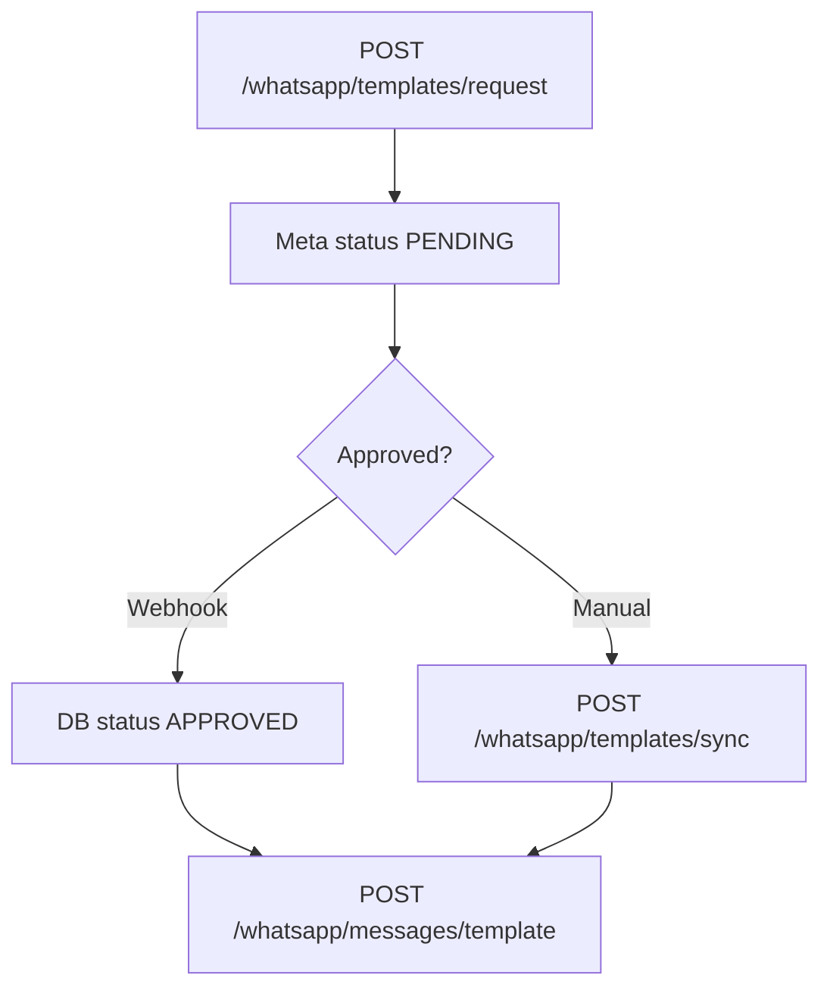

# WhatsApp API — Complete Integration Guide (React + Super Admin)

Base: `https://api.kaburlumedia.com/api/v1`  
Webhook (Meta): `https://api.kaburlumedia.com/api/v1/webhooks/whatsapp`

---

## 1. Required `.env` (server)

```env
WHATSAPP_OTP_ENABLED=true
WHATSAPP_ACCESS_TOKEN=EAAxxxxx
WHATSAPP_PHONE_NUMBER_ID=123456789
WHATSAPP_BUSINESS_ACCOUNT_ID=987654321
WHATSAPP_DEFAULT_COUNTRY_CODE=91
WHATSAPP_WEBHOOK_VERIFY_TOKEN=your_random_verify_token

# Pre-approved template names (after Meta approval)
WHATSAPP_OTP_TEMPLATE_NAME=kaburlu_app_otp
WHATSAPP_OTP_TEMPLATE_LANG=en_US
WHATSAPP_IDCARD_TEMPLATE_NAME=send_idcard_reporter
WHATSAPP_IDCARD_TEMPLATE_LANG=en_US
WHATSAPP_SUPPORT_MOBILE=9392010248
WHATSAPP_OTP_TTL_TEXT=10 minutes
```

Check config:

```http
GET /whatsapp/config
Authorization: Bearer <SUPER_ADMIN_JWT>
```

---

## 2. End-to-end flow



### Meta App setup (one time)

1. **WhatsApp → Configuration → Webhook**  
   - URL: `https://api.kaburlumedia.com/api/v1/webhooks/whatsapp`  
   - Verify token: same as `WHATSAPP_WEBHOOK_VERIFY_TOKEN`  
2. Subscribe fields: `messages`, `message_template_status_update`  
3. **Permanent token** with `whatsapp_business_management`, `whatsapp_business_messaging`

---

## 3. Super Admin APIs

| Action | Method | Path |
|--------|--------|------|
| Config check | GET | `/whatsapp/config` |
| List DB templates | GET | `/whatsapp/templates?status=APPROVED` |
| Live from Meta | GET | `/whatsapp/templates/fetch-live` |
| **Request new template** | POST | `/whatsapp/templates/request` |
| **Sync after approval** | POST | `/whatsapp/templates/sync` |
| Get one | GET | `/whatsapp/templates/{name}` |
| Delete | DELETE | `/whatsapp/templates/{name}` |
| **Send any approved template** | POST | `/whatsapp/messages/template` |
| Send OTP test | POST | `/whatsapp/messages/otp` |
| Send ID card PDF | POST | `/whatsapp/messages/id-card` |
| Send text (24h window) | POST | `/whatsapp/messages/text` |
| Upload media → media_id | POST | `/whatsapp/media/upload` |
| Webhook debug log | GET | `/whatsapp/webhook-events` |

Auth: `SUPER_ADMIN` JWT for create/delete/send test.  
`TENANT_ADMIN` can list/sync/fetch-live.

---

## 4. Create template (request approval)

```json
POST /api/v1/whatsapp/templates/request
Authorization: Bearer <SUPER_ADMIN_JWT>

{
  "name": "union_survey_reminder",
  "language": "en_US",
  "category": "UTILITY",
  "components": [
    {
      "type": "BODY",
      "text": "Hi {{1}}, please complete your {{2}} survey before {{3}}."
    },
    {
      "type": "FOOTER",
      "text": "Democratic Journalist Federation"
    }
  ]
}
```

**Rules (Meta):**

- `name`: lowercase, underscores only  
- `category`: `UTILITY` | `MARKETING` | `AUTHENTICATION`  
- Body variables: `{{1}}`, `{{2}}` — must pass same count when sending  

**Response:**

```json
{
  "success": true,
  "message": "Template submitted to Meta. Status is usually PENDING...",
  "template": { "name": "union_survey_reminder", "status": "PENDING" }
}
```

Wait 24–48h or webhook `APPROVED`, then:

```http
POST /whatsapp/templates/sync
```

---

## 5. Send approved template

```json
POST /api/v1/whatsapp/messages/template

{
  "to": "9392010248",
  "templateName": "union_survey_reminder",
  "languageCode": "en_US",
  "bodyParams": ["Ramesh", "Union", "30 May 2026"]
}
```

With URL button (OTP-style):

```json
{
  "to": "9392010248",
  "templateName": "kaburlu_app_otp",
  "languageCode": "en_US",
  "bodyParams": ["123456", "Login", "10 minutes", "9392010248"],
  "urlButtonParam": "123456"
}
```

With document header (after media upload):

```json
POST /whatsapp/media/upload
{ "fileUrl": "https://cdn.../card.pdf", "mimeType": "application/pdf" }

POST /whatsapp/messages/template
{
  "to": "9392010248",
  "templateName": "send_idcard_reporter",
  "bodyParams": ["Reporter ID", "Kaburlu Today", "ID Card"],
  "header": { "format": "DOCUMENT", "mediaId": "<from upload>" }
}
```

Or use shortcut:

```json
POST /whatsapp/messages/id-card
{
  "to": "9392010248",
  "pdfUrl": "https://cdn.../press-card.pdf",
  "organizationName": "Kaburlu Today"
}
```

---

## 6. OTP (production path)

Already wired in `POST /auth/otp/send` when `WHATSAPP_OTP_ENABLED=true`.

Manual test:

```json
POST /whatsapp/messages/otp
{ "to": "9392010248", "otp": "482910", "purpose": "Login" }
```

---

## 7. React service (copy-paste)

```js
const API = import.meta.env.VITE_API_BASE_URL;
const auth = () => ({ Authorization: `Bearer ${localStorage.getItem('kaburlu_jwt')}` });

export const whatsappApi = {
  config: () => fetch(`${API}/whatsapp/config`, { headers: auth() }).then((r) => r.json()),

  listTemplates: (status) =>
    fetch(`${API}/whatsapp/templates${status ? `?status=${status}` : ''}`, { headers: auth() }).then(
      (r) => r.json(),
    ),

  requestTemplate: (body) =>
    fetch(`${API}/whatsapp/templates/request`, {
      method: 'POST',
      headers: { ...auth(), 'Content-Type': 'application/json' },
      body: JSON.stringify(body),
    }).then((r) => r.json()),

  syncTemplates: () =>
    fetch(`${API}/whatsapp/templates/sync`, { method: 'POST', headers: auth() }).then((r) =>
      r.json(),
    ),

  sendTemplate: (body) =>
    fetch(`${API}/whatsapp/messages/template`, {
      method: 'POST',
      headers: { ...auth(), 'Content-Type': 'application/json' },
      body: JSON.stringify(body),
    }).then((r) => r.json()),

  sendOtp: (to, otp, purpose) =>
    fetch(`${API}/whatsapp/messages/otp`, {
      method: 'POST',
      headers: { ...auth(), 'Content-Type': 'application/json' },
      body: JSON.stringify({ to, otp, purpose }),
    }).then((r) => r.json()),
};
```

---

## 8. Super Admin UI screens

1. **WhatsApp Settings** — `GET /config` (green/red indicators)  
2. **Templates** — table from `GET /templates`, filter `PENDING` / `APPROVED`  
3. **Create template** — form → `POST /templates/request`  
4. **Sync button** — `POST /templates/sync`  
5. **Send test** — phone + template + body params → `POST /messages/template`  
6. **Webhook log** — `GET /webhook-events` for failed delivery  

---

## 9. Common errors

| Error | Fix |
|-------|-----|
| `WHATSAPP_BUSINESS_ACCOUNT_ID not configured` | Add to server `.env` |
| Template not APPROVED | Wait / sync / check Meta Business Manager |
| `(#131008) Required parameter missing` | bodyParams count must match `{{n}}` in template |
| Text message fails | User must message you first (24h window) |
| P1001 DB on Mac | Use `npm run migrate:droplet` not local prisma |

---

## 10. Deploy

```bash
npm run build
SKIP_LOCAL_BUILD=true npm run deploy:droplet
```

Swagger tag: **WhatsApp**
